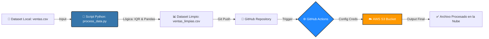

# Limpieza de Datos con Python y Pandas (ETL Pipeline)

Badges: Python | AWS | GitHub Actions | MIT License

## 📝 Descripción
Pipeline de datos automatizado (ETL: Extract, Transform, Load) diseñado para la limpieza de datasets mediante el método estadístico IQR (Rango Intercuartílico) para la detección y eliminación de outliers.

Este proyecto implementa CI/CD con GitHub Actions para cargar automáticamente los datos procesados a un bucket de AWS S3.

Casos de uso:
- Preparación de datos para análisis financiero y auditorías.
- Limpieza automatizada de datos crudos antes de ingestas en Data Warehouses.
- Ejemplo práctico de arquitectura serverless y automatización de tareas.

## 🏗️ Arquitectura del Proyecto
Flujo de datos desde la fuente local hasta el almacenamiento en la nube:



## 🚀 Tecnologías Utilizadas
- Python: Lenguaje principal para la lógica de procesamiento.
- Pandas: Librería para manipulación y análisis de datos.
- AWS S3: Almacenamiento de objetos escalable (Data Lake).
- Boto3: SDK de AWS para Python.
- GitHub Actions: Automatización de flujos de trabajo (CI/CD).

## 📂 Estructura del Proyecto
```
LIMPIEZA_DATOS/
├── .github/
│   └── workflows/
│       └── deploy-to-s3.yml   # Configuración CI/CD
├── assets/
│   └── images/                # Diagramas y recursos
├── scripts/                   # Scripts auxiliares (opcional)
├── uploads/                   # Carpeta de entrada/salida local
├── .gitignore                 # Archivos ignorados por Git
├── process_data.py            # Script principal (ETL)
├── ventas.csv                 # Dataset de entrada (Raw)
├── ventas_limpias.csv         # Dataset procesado (Clean)
├── requirements.txt           # Dependencias del proyecto
└── README.md
```

## ⚙️ Instalación y Configuración
1. Clonar el Repositorio
   ```bash
   git clone https://github.com/jotalexvalencia/limpieza-datos-python-pandas.git
   cd limpieza-datos-python-pandas
   ```
2. Crear Entorno Virtual (recomendado)
   ```bash
   # Windows
   python -m venv env
   env\Scripts\activate

   # macOS/Linux
   python3 -m venv env
   source env/bin/activate
   ```
3. Instalar Dependencias
   ```bash
   pip install -r requirements.txt
   ```
4. Configuración de AWS
   Asegúrate de tener configuradas tus credenciales de AWS localmente o como Secrets en tu repositorio de GitHub (AWS_ACCESS_KEY_ID y AWS_SECRET_ACCESS_KEY).

## 🛠️ Uso
1. Coloca tu archivo de datos crudos en la raíz del proyecto con el nombre `ventas.csv`.
2. Ejecuta el script de limpieza:
   ```bash
   python process_data.py
   ```
3. Se generará `ventas_limpias.csv` eliminando los valores atípicos detectados por el método IQR.

## 🤖 Automatización (CI/CD)
Este proyecto utiliza GitHub Actions para desplegar automáticamente el archivo procesado a AWS S3 cada vez que se realiza un push a la rama `dev-python`.

Flujo del workflow:
- Checkout: Descarga el código del repositorio.
- Setup: Configura las credenciales de AWS de forma segura usando Secrets.
- Deploy: Sube el archivo `ventas_limpias.csv` al bucket S3 especificado.

## 📊 Ejemplo de Lógica (IQR)
El script utiliza el Rango Intercuartílico para filtrar datos anómalos:

1. Calcular Q1 (25%) y Q3 (75%).
2. Obtener IQR = Q3 - Q1.
3. Definir límites:
   - Inferior: Q1 - 1.5 * IQR
   - Superior: Q3 + 1.5 * IQR
4. Mantener solo los datos dentro de esos límites.

## 👤 Autor
Jorge Alexander Valencia Valencia  
LinkedIn | GitHub

## 📄 Licencia
Este proyecto está bajo la Licencia MIT.