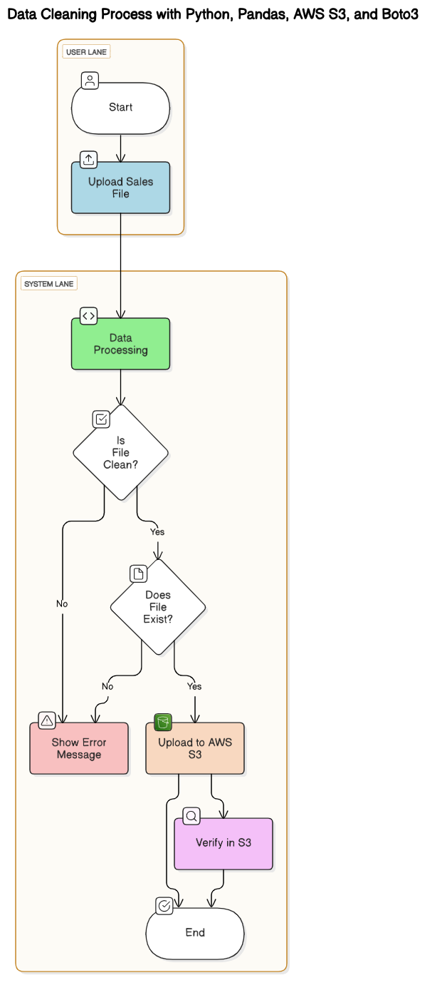

# Limpieza de Datos con Python y Pandas



## Descripción
Este proyecto incluye un script que elimina **outliers** en un dataset de ventas utilizando el método **IQR (Rango Intercuartílico)**.

**Casos de uso**:
- Ideal para analítica financiera y auditorías de datos.
- Almacena los resultados procesados en **AWS S3** para almacenamiento seguro y accesible.

## Tecnologías
- **Python**: Lenguaje principal.
- **Pandas**: Librería para manipulación y análisis de datos.
- **AWS S3 y Boto3**: Servicios y librerías para almacenamiento en la nube.

## Estructura del Proyecto
```plaintext
LIMPIEZA_DATOS/
├── .github/
│   └── workflows/
│       └── deploy-to-s3.yml
├── .qodo/  (archivos personales ignorados)
├── env/  (entorno virtual, ignorado en .gitignore)
├── ventas.csv  (dataset de entrada)
├── ventas_limpias.csv  (dataset limpio generado por el script)
├── README.md
├── process_data.py  (script principal del proyecto)
└── aws-s3.png  (imagen de referencia para S3)
```

## Instalación
1. Clona el repositorio:
   ```bash
   git clone https://github.com/jotalexvalencia/limpieza-datos-python-pandas.git
   ```
2. Navega al directorio del proyecto:
   ```bash
   cd limpieza-datos-python-pandas
   ```
3. Instala las dependencias: Si trabajas con un entorno virtual, actívalo antes de instalar las dependencias:
   ```bash
   pip install pandas boto3
   ```

## Uso
1. Configura tu archivo `ventas.csv` con los datos a analizar (debe estar en el directorio raíz del proyecto).

2. Ejecuta el script:
   ```bash
   python process_data.py
   ```

3. Resultados:
   - El archivo limpio `ventas_limpias.csv` será generado automáticamente.
   - Será cargado al bucket configurado en AWS S3.

## Flujo de Trabajo Automatizado
Este proyecto incluye un workflow de GitHub Actions que automatiza el despliegue del archivo procesado a AWS S3.

- **Activación**: Se ejecuta cada vez que hay un push en la rama principal (dev-python).
- **Configuración**: Utiliza credenciales seguras almacenadas como Secrets en GitHub.
- **Detalles**: Consulta el archivo `.github/workflows/deploy-to-s3.yml` para más información.

## Ejemplo de Salida
**Input**:
Archivo `ventas.csv`:
```
Producto,Precio,Cantidad
Producto_A,1000,10
Producto_B,5000,3
Producto_C,200,50
```

**Output**:
Archivo `ventas_limpias.csv`:
```
Producto,Precio,Cantidad
Producto_A,1000,10
Producto_B,5000,3
Producto_C,200,50
```

Archivo cargado a AWS S3:
El archivo `ventas_limpias.csv` se carga automáticamente a AWS S3 utilizando el bucket configurado en el archivo `aws-s3.png`.

## Referencias
- [GitHub Actions](https://docs.github.com/en/actions)
- [AWS S3](https://aws.amazon.com/es/s3/)
- [Pandas](https://pandas.pydata.org/)
- [Boto3](https://boto3.amazonaws.com/v1/documentation/api/latest/index.html)

## Autor
Jorge Alexander Valencia Valencia

## Licencia
Este proyecto está bajo la [Licencia MIT](LICENSE) © 2025 Jorge Alexander Valencia Valencia. Para más detalles, consulta el archivo `LICENSE`.

